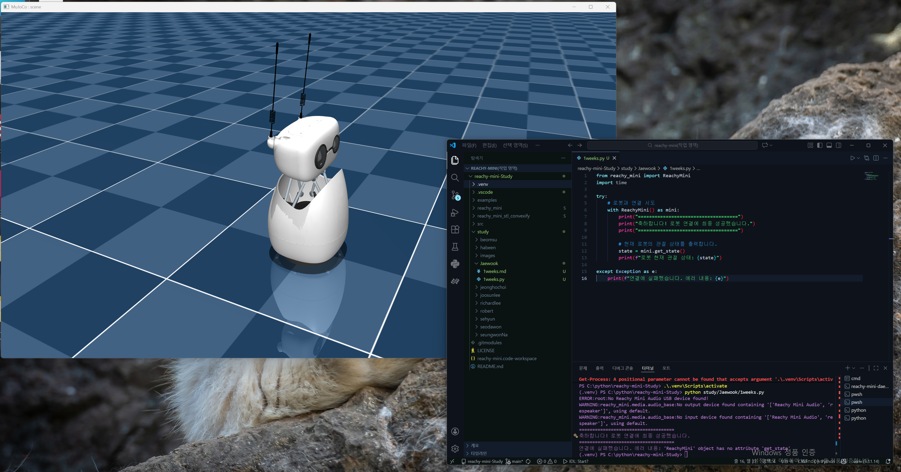

주의사항: 'pwd' 에러가 다시 날 경우
위 명령어를 실행했을 때 다시 ModuleNotFoundError: No module named 'pwd' 에러가 발생한다면, 아까 복기했던 패치 작업을 다시 확인해야 합니다.

파일 경로: .venv\Lib\site-packages\reachy_mini\utils\wireless_version\startup_check.py

수정 내용: import pwd 앞에 #을 붙여 # import pwd로 만듭니다.

저장: 반드시 Ctrl + S로 저장한 뒤 다시 시뮬레이터 명령어를 입력하세요.

이제 1주차의 마지막 관문인 시뮬레이터 실행 단계입니다. 현재 발생한 에러는 파이썬에게 "이 패키지 안에 있는 프로그램을 실행해줘"라고 명령할 때, 실행 지점이 아주 약간 어긋나서 발생하는 문제입니다.

가장 확실하게 시뮬레이터를 켜는 두 가지 방법을 제안해 드립니다.

1. 첫 번째 방법: 표준 명령어로 실행 (추천)
가상환경이 활성화된 상태((.venv)가 보이는 상태)에서는 패키지를 설치할 때 함께 생성된 전용 실행 명령어를 바로 사용할 수 있습니다.

PowerShell

reachy-mini-daemon --sim
결과 확인: 이 명령어를 치고 빨간 에러 없이 창이 멈춘 듯이 유지된다면 성공입니다.

2. 두 번째 방법: 모듈 경로를 정확히 지정하기
사용자님이 시도하셨던 명령어를 아주 조금만 수정하면 됩니다. app 뒤에 .main을 붙여서 실행 파일의 위치를 정확히 찍어주는 방식입니다.

PowerShell

python -m reachy_mini.daemon.app.main --sim
에러 해결 원인: reachy_mini.daemon.app은 폴더(패키지) 이름이고, 실제 실행되는 코드는 그 안의 main.py에 들어 있기 때문에 이를 명시해줘야 합니다.