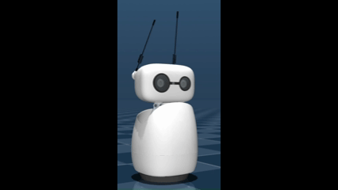

# mujoco 설치

**Git LFS (Large File Storage):**

- 3D 모델(메쉬 파일)을 다운로드하기 위해 필수입니다.
- [git-lfs.com](https://git-lfs.com/)에서 윈도우용 인스톨러를 받아 설치하세요.
- 설치 후 터미널에서 `git lfs install`을 한 번 입력해 줍니다

mujoco 설시치

```bash
pip install "reachy-mini[mujoco]"
```

설치 시 반드시 따옴표를 사용해야 합니다. 따옴표 없이 설치하면 셸에서 대괄호를 잘못 해석할 수 있습니다.

수정 완료. 문제 원인과 해결 방법을 정리했습니다.

python -m pip install --upgrade pip # pip 버전 발생 에러



## 코드 실행시 에러

### **1.에러**: AttributeError: 'ReachyMini' object has no attribute 'get_state'

 **원인**: ReachyMini 클래스에는 get_state() 메서드가 없습니다.

### **해결 방법**

get_state() 대신 다음 메서드를 사용하도록 코드를 수정했습니다:

1. **get_current_joint_positions()** - 헤드와 안테나의 현재 관절 위치 반환
2. **get_current_head_pose()** - 현재 헤드 포즈(4x4 행렬) 반환
3. **get_present_antenna_joint_positions()** - 안테나 관절 위치만 반환.

## **2.에러**:

ERROR:root:No Reachy Mini Audio USB device found!
WARNING:reachy_mini.media.audio_base:No output device found containing '['Reachy Mini Audio', 'respeaker']', using default.
WARNING:reachy_mini.media.audio_base:No input device found containing '['Reachy Mini Audio', 'respeaker']', using default.

### **해결방법**

위의 오디오 관련 경고는 시뮬레이터 환경에서는 정상이며 무시해도 됩니다.