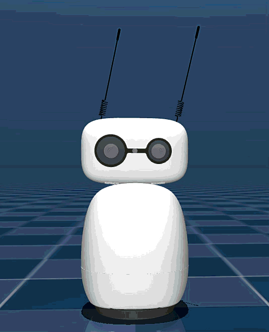

# 기본동작제어

### **과제**

8자 패턴으로 머리를 움직이는 프로그램 작성

## **프로그램 설명**

**주요 기능**

1. draw_figure_eight() 함수: 8자 패턴을 그리는 함수
- 파라미터 방정식 사용: x = sin(t), y = sin(2*t) / 2
- 50개 점으로 부드러운 곡선 생성
1. 조정 가능한 파라미터:
- num_cycles: 반복 횟수 (기본값: 2)
- amplitude: 패턴 크기 (밀리미터, 기본값: 20mm)
- speed: 각 포즈 간 이동 시간 (초, 기본값: 0.1초)
- z_offset: 높이 오프셋 (밀리미터, 기본값: 0)

**사용 방법**

셀을 실행하면:

1. 8자 패턴을 지정한 횟수만큼 반복
2. 각 포즈로 부드럽게 이동
3. 완료 후 초기 위치로 복귀

```python
import numpy as np
import time
from reachy_mini import ReachyMini
from reachy_mini.utils import create_head_pose

def draw_figure_eight(mini, num_cycles=2, amplitude=20, speed=0.1, z_offset=0):
    """
    8자 패턴으로 머리를 움직이는 함수
    
    Args:
        mini: ReachyMini 인스턴스
        num_cycles: 8자 패턴을 몇 번 반복할지 (기본값: 2)
        amplitude: 8자 패턴의 크기 (밀리미터, 기본값: 20mm)
        speed: 각 포즈 간 이동 속도 (초, 기본값: 0.1초)
        z_offset: Z축 오프셋 (밀리미터, 기본값: 0)
    """
    # 8자 패턴을 그리기 위한 파라미터 방정식
    # t는 0부터 2π까지 변화하며, 8자 패턴을 그립니다
    num_points = 50  # 8자 패턴을 그리기 위한 점의 개수
    
    for cycle in range(num_cycles):
        print(f"8자 패턴 {cycle + 1}/{num_cycles} 시작...")
        
        for i in range(num_points):
            # 파라미터 t: 0부터 2π까지
            t = 2 * np.pi * i / num_points
            
            # 8자 패턴의 파라미터 방정식
            # x(t) = sin(t)
            # y(t) = sin(2*t) / 2
            x = amplitude * np.sin(t)  # X축 이동
            y = amplitude * np.sin(2 * t) / 2  # Y축 이동 (8자 패턴)
            
            # 머리 포즈 생성 (밀리미터 단위)
            pose = create_head_pose(x=x, y=y, z=z_offset, mm=True)
            
            # 목표 위치로 이동
            mini.goto_target(head=pose, duration=speed)
        
        print(f"8자 패턴 {cycle + 1}/{num_cycles} 완료")
    
    # 초기 위치로 복귀
    print("초기 위치로 복귀 중...")
    initial_pose = create_head_pose()
    mini.goto_target(head=initial_pose, duration=1.0)
    print("완료!")

# 실행
with ReachyMini() as mini:
    # 8자 패턴 그리기
    # num_cycles: 반복 횟수
    # amplitude: 패턴 크기 (mm)
    # speed: 각 포즈 간 이동 시간 (초)
    # z_offset: 위/아래 오프셋 (mm)
    draw_figure_eight(
        mini, 
        num_cycles=1,      # 2번 반복
        amplitude=20,      # 20mm 크기
        speed=0.3,         # 각 포즈마다 0.1초
        z_offset=0         # 높이 오프셋 없음
    )

```


[](https://www.notion.so)

[https://www.notion.so](https://www.notion.so)

안테나로 다양한 감정 표현하기 (두려움)

## 

## **두려움 표현 프로그램 설명**

**주요 동작 단계**

1. 뒤로 물러서기
- 머리를 뒤로 젖히고 아래로 숙임
- 안테나를 뒤로 기울임 (방어 자세)
- 바디를 뒤로 기울임
1. 머리 숙이기
- 더 아래로 숙여 회피 자세
1. 떨림 표현
- 작은 범위로 빠른 진동 움직임
1. 방어 자세 강화
- 더 작아지는 자세
- 머리를 더 숙이고 안테나를 더 뒤로
1. 불안한 움직임
- 빠르게 좌우로 흔들기
1. 초기 위치 복귀
- 부드럽게 원래 자세로 복귀

**특징**

- 머리: 뒤로 젖히고 아래로 숙임 (pitch 음수)
- 안테나: 뒤로 기울임 (음수 각도)
- 바디: 뒤로 기울임 (body_yaw 음수)
- 움직임: 빠르고 작은 범위의 떨림

셀을 실행하면 Reachy Mini가 두려움을 표현합니다.

```python
import numpy as np
import time
from reachy_mini import ReachyMini
from reachy_mini.utils import create_head_pose

def express_fear(mini):
    """
    두려움 표현: 
    - 머리를 뒤로 젖히고 아래로 숙이기
    - 안테나를 뒤로 기울이기 (방어 자세)
    - 빠르고 작은 떨림 움직임
    - 바디를 뒤로 기울이기
    """
    print("두려움 표현 시작...")
    
    # 1. 초기 반응: 갑자기 뒤로 물러서기
    print("1. 뒤로 물러서기...")
    mini.goto_target(
        head=create_head_pose(x=-5, z=-10, pitch=-15, degrees=True, mm=True),
        antennas=np.deg2rad([-30, -30]),  # 안테나를 뒤로 기울이기
        body_yaw=np.deg2rad(-10),  # 바디를 뒤로 기울이기
        duration=2
    )
    time.sleep(0.3)
    
    # 2. 머리를 아래로 숙이기 (회피 자세)
    print("2. 머리 숙이기...")
    mini.goto_target(
        head=create_head_pose(x=-8, z=-15, pitch=-20, degrees=True, mm=True),
        antennas=np.deg2rad([-40, -40]),
        body_yaw=np.deg2rad(-15),
        duration=2
    )
    time.sleep(0.2)
    
    # 3. 떨림 움직임 (작고 빠른 진동)
    print("3. 떨림 표현...")
    for i in range(6):
        # 작은 범위로 빠르게 좌우로 움직이기
        offset = 2 * np.sin(i * np.pi / 3)  # 작은 진동
        mini.goto_target(
            head=create_head_pose(x=-8 + offset, y=offset, z=-15, pitch=-20, degrees=True, mm=True),
            antennas=np.deg2rad([-40 + i*2, -40 + i*2]),
            duration=2
        )
    
    # 4. 더 작아지기 (방어 자세 강화)
    print("4. 방어 자세 강화...")
    mini.goto_target(
        head=create_head_pose(x=-10, z=-20, pitch=-25, roll=5, degrees=True, mm=True),
        antennas=np.deg2rad([-50, -50]),
        body_yaw=np.deg2rad(-20),
        duration=2
    )
    time.sleep(0.5)
    
    # 5. 빠르게 좌우로 흔들기 (불안한 움직임)
    print("5. 불안한 움직임...")
    for _ in range(3):
        mini.goto_target(
            head=create_head_pose(x=-10, y=-8, z=-20, pitch=-25, yaw=-10, degrees=True, mm=True),
            antennas=np.deg2rad([-50, -40]),
            duration=2
        )
        mini.goto_target(
            head=create_head_pose(x=-10, y=8, z=-20, pitch=-25, yaw=10, degrees=True, mm=True),
            antennas=np.deg2rad([-40, -50]),
            duration=2
        )
    
    # 6. 초기 위치로 복귀
    print("6. 초기 위치로 복귀...")
    mini.goto_target(
        head=create_head_pose(),
        antennas=[0, 0],
        body_yaw=0,
        duration=1.5
    )
    print("두려움 표현 완료!")

# 실행
with ReachyMini() as mini:
    express_fear(mini)
```




